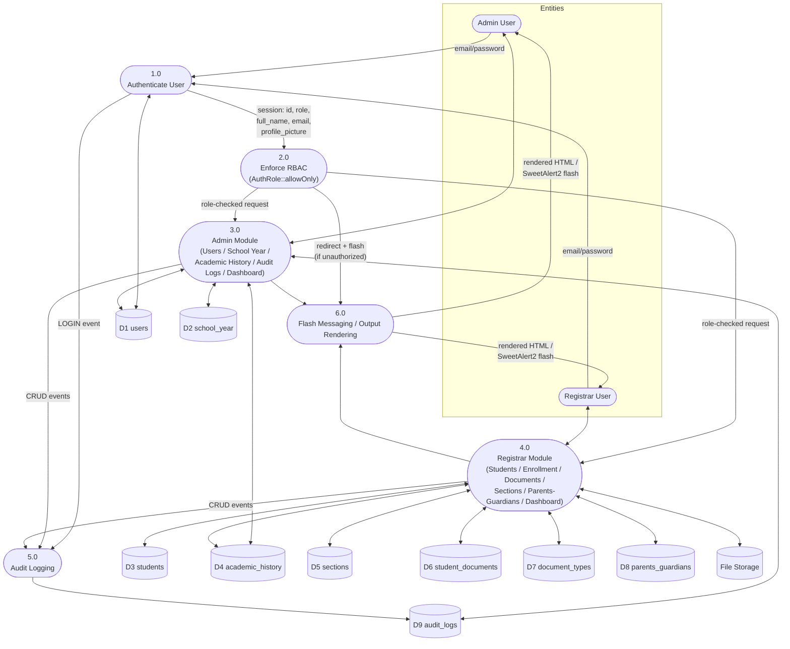
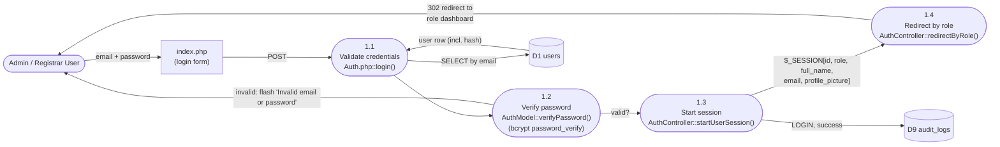
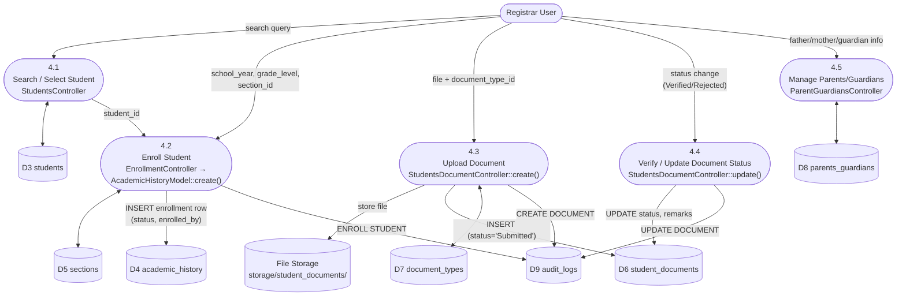

# LIMSACS — Data Flow Diagram (DFD)

System: School Registrar / Learner Information Management System (LIMSACS)
Scope: Authentication → RBAC → Core Modules → Data Stores → Output
Notation: Gane–Sarson (Process = rounded rectangle, Data Store = open rectangle,
External Entity = rectangle, Data Flow = labeled arrow). Diagrams are written in
Mermaid `flowchart` syntax so they render directly in VS Code / GitHub previews.

---

## 1. Scope & Methodology

This document was derived from the current codebase (no separate router; direct
file-to-controller dispatch). Key facts used as ground truth:

- Front door: `index.php` (login form) → POST → `app/controllers/Auth.php`
- DB connection: `database/config/config.php` → `Database` class → global `mysqli $con`
- Base classes: `app/controllers/Controller.php` (abstract), `app/models/Model.php` (wraps `$con`)
- RBAC guard: `app/middleware/Auth.php` → `AuthRole::allowOnly([...roles])`, called at the
  top of every protected view (`resources/views/{role}/*.php`)
- Cross-cutting helpers: `app/helpers/flashMessage.php` (`FlashMessage`),
  `app/helpers/auditLogs.php` (`AuditLogs`), `app/helpers/password.php` (bcrypt)
- File output: uploaded files under `storage/student_documents/` and `storage/profiles/`
- No PDF/CSV export library is present (no dompdf/mpdf/tcpdf/phpspreadsheet) — output is
  HTML views rendered by controllers + Chart.js dashboards.

---

## 2. External Entities

| Entity | Description |
|---|---|
| **Admin User** | Manages users, school years, audits, system-wide views |
| **Registrar User** | Manages students, enrollment, documents, sections, parents/guardians |
| **Teacher** (`users.role = teacher`) | Assignable as section adviser; currently has no dedicated controller/view set (account exists in RBAC roles but no teacher module found in `app/controllers`) |
| **File System** | `storage/student_documents/`, `storage/profiles/` — receives/serves uploaded files |
| **MySQL Database** (`limsacsdb`) | All persistent data stores (see §6) |

---

## 3. Context Diagram (Level 0)

---

## 4. Level 1 DFD — Major Processes

---

## 5. Level 2 DFDs (per process)

### 5.1 Process 1.0 — Authenticate User

**Key detail:** password hashing uses `password_hash($password, PASSWORD_BCRYPT, ['cost' => 10])`
(`app/helpers/password.php`); verification is `password_verify()`. No plaintext password is
ever stored or logged.

### 5.2 Process 2.0 — Enforce RBAC

**Roles enforced today:** `admin`, `registrar` (every admin view calls
`AuthRole::allowOnly(['admin'])`; every registrar view calls `AuthRole::allowOnly(['registrar'])`).
`teacher` exists as a `users.role` value (assignable as `sections.adviser_id`) but has **no
protected views/controllers of its own** — there is no `allowOnly(['teacher'])` call anywhere
in the codebase.

### 5.3 Process 4.0 — Registrar Module: Student Enrollment & Documents (representative subflow)

---

## 6. Data Stores (Data Dictionary)

All access goes through MySQLi **prepared statements** (no PDO; parameterized
`bind_param`) — no raw string interpolation of user input into SQL was found.

| ID | Store | Key Columns | Written by | Read by |
|---|---|---|---|---|
| D1 | `users` | id, full_name, email, password(bcrypt), role, profile_picture, created_at, updated_at | Auth (register/update), Admin UsersController | Auth (login), RBAC middleware, Admin dashboards |
| D2 | `school_year` | id, school_year, start_date, end_date, status(active/inactive/archived) | Admin SchoolYearController | Registrar Enrollment, Sections, Dashboards |
| D3 | `students` | id, lrn, first_name, middle_name, last_name, suffix, gender, birth_date, age, place_of_birth, nationality, religion, address, contact_number | Registrar StudentsController | StudentsController, EnrollmentController, Admin AcademicHistoryController |
| D4 | `academic_history` | id, student_id(FK), enrolled_by(FK→users), school_year_id(FK), grade_level, section_id(FK), enrollment_status | Registrar EnrollmentController | Admin AcademicHistoryController, Registrar/Admin dashboards |
| D5 | `sections` | id, section_name, grade_level, adviser_id(FK→users), school_year_id(FK), max_students | Registrar SectionsController | EnrollmentController |
| D6 | `student_documents` | id, student_id(FK), document_type_id(FK), file_path, status(Pending/Submitted/Verified/Rejected), remarks, uploaded_by(FK→users), uploaded_at | Registrar StudentsDocumentController | StudentsController (profile modal), Admin/Registrar dashboards |
| D7 | `document_types` | id, document_name, is_required, is_active | Registrar DocumentTypesController | StudentsDocumentController |
| D8 | `parents_guardians` | id, student_id(FK), father_*, mother_*, guardian_name, guardian_relationship, guardian_contact, created_at | Registrar ParentGuardiansController | Student profile view |
| D9 | `audit_logs` | id, user_id(FK), role, action, module, reference_id, reference_table, description, ip_address, status(success/failed), created_at | `AuditLogs::log()` (called from nearly every controller mutation) | Admin AuditLogsController |

---

## 7. Output Layer

| Output | Mechanism | Notes |
|---|---|---|
| Role dashboards | Server-rendered HTML + Chart.js | Grade-level distribution, document status pie, registration trend (admin & registrar) |
| Student profile modal | AJAX (`action=get_student_profile`) → JSON → JS render | Includes documents checklist tab (recently added, see git status) |
| Flash notifications | `FlashMessage` (session-based) → SweetAlert2 modal on next page load | Used after every create/update/delete/login |
| Uploaded documents | Served back via `<a href="{file_path}" target="_blank">` from `storage/student_documents/` | No access-control check observed on the static file path itself beyond it being unguessable-by-convention — **flag for review** |
| Audit trail | `audit-logs.php` (admin only) | Read-only table view + delete |
| Exports (PDF/CSV) | **None found** | No dompdf/mpdf/tcpdf/phpspreadsheet dependency in repo |

---

## 8. Notable Gaps / Risks Surfaced While Mapping

These are observations from tracing the flows, not changes made:

1. **Teacher role is structurally a third RBAC role but functionally unused** — no
   `allowOnly(['teacher'])` anywhere, no teacher controllers/views. Either dead scope or
   pending module.
2. **Static file serving for `storage/student_documents/`** is not run through a
   controller/RBAC check in what was traced — if the web server serves that directory
   directly, document URLs are protected only by obscurity, not by `AuthRole`.
3. **No router/front controller** — authorization is opt-in per view (each view must
   remember to call `AuthRole::allowOnly()`); a new view that forgets this call is an
   open page by default, since `index.php` is the only file enforcing the check is fully
   self-policed. This is a defense-in-depth gap worth a lint/checklist rather than a runtime fix.

---

## 9. Source Reference Index

| Concern | File |
|---|---|
| Login entry | `index.php` |
| Auth controller | `app/controllers/Auth.php` |
| Auth model | `app/models/AuthModel.php` |
| Password hashing | `app/helpers/password.php` |
| RBAC middleware | `app/middleware/Auth.php` |
| DB connection | `database/config/config.php` |
| Base Controller/Model | `app/controllers/Controller.php`, `app/models/Model.php` |
| Flash messages | `app/helpers/flashMessage.php` |
| Audit logging | `app/helpers/auditLogs.php` |
| Admin controllers | `app/controllers/admin/*.php` |
| Registrar controllers | `app/controllers/registrar/*.php` |
| Schema reference | `backups/limsacsdb.sql` |
