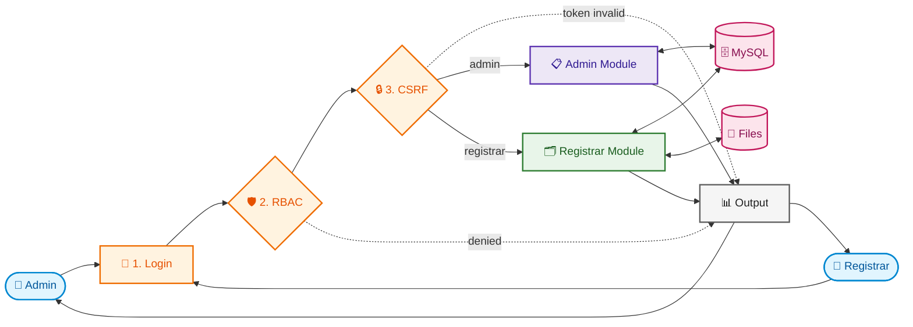
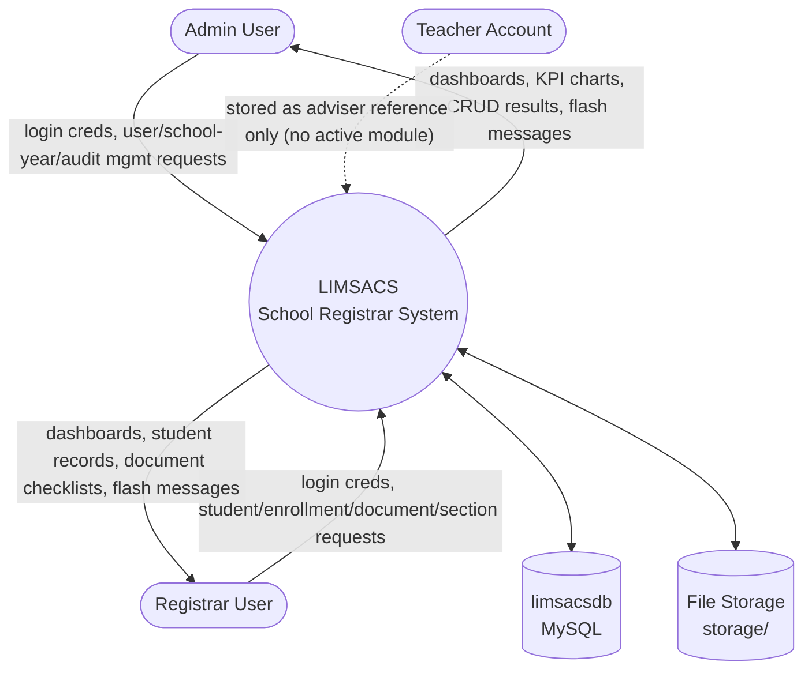
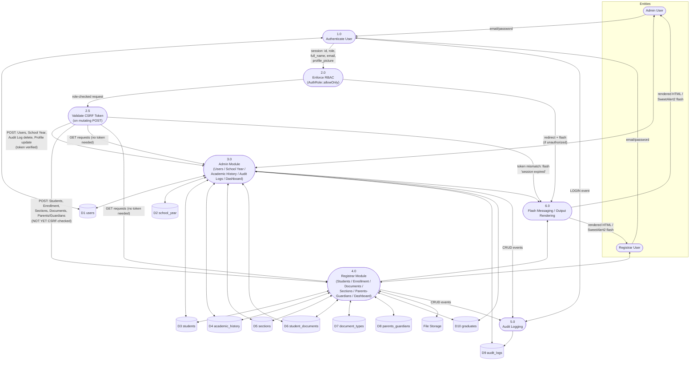
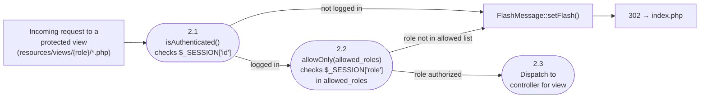
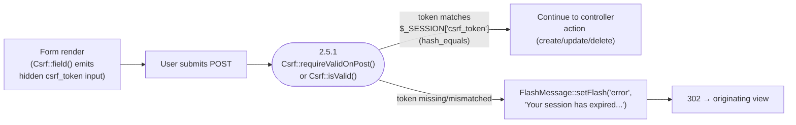
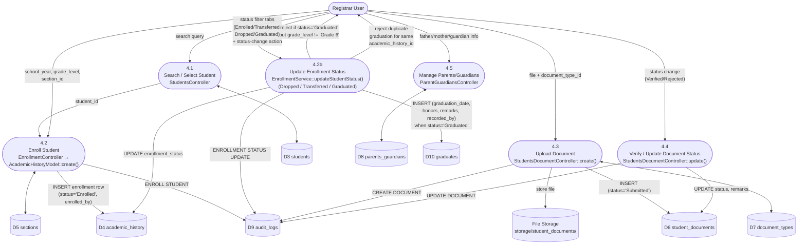

# LIMSACS — Data Flow Diagram (DFD)

System: School Registrar / Learner Information Management System (LIMSACS)
Scope: Authentication → RBAC → Core Modules → Data Stores → Output
Notation: Gane–Sarson (Process = rounded rectangle, Data Store = open rectangle,
External Entity = rectangle, Data Flow = labeled arrow). Diagrams are written in
Mermaid `flowchart` syntax so they render directly in VS Code / GitHub previews.

> 🖥️ A standalone, zoomable/pannable version of the overview diagram below is also available at
> [`docs/dfd-overview.html`](dfd-overview.html) — open it directly in a browser.

---

## 0. Visual Overview (Quick Reference)

This is a simplified, color-coded read of the full system — every numbered process below maps
to a detailed Level 1/2 diagram further down this document. Use this view to orient yourself;
use §3 onward for implementation-accurate detail (exact method names, validation rules, table
columns).

**Reading the colors:** 🟦 blue = external entity (the human user) · 🟧 orange = a security gate
every request passes through · 🟪 purple = admin-only processes · 🟩 green = registrar-only
processes · 🟥 pink = persistent data stores · ⬜ grey = rendered output back to the user.

**What's inside each module:**
- **Admin Module** → Users · School Years · Academic History · Audit Logs · Dashboard
- **Registrar Module** → Students · Enrollment · Sections · Documents · Parents/Guardians · Dashboard

**Reading the dotted arrows:** a dotted line means "this is a rejection/short-circuit path" —
the request never reaches a business module. Note the CSRF gate is only fully enforced for the
Admin path today (see §5.2b for exactly which registrar controllers still skip it).

---

## 1. Scope & Methodology

This document was derived from the current codebase (no separate router; direct
file-to-controller dispatch). Key facts used as ground truth:

- Front door: `index.php` (login form) → POST → `app/controllers/Auth.php`
- DB connection: `database/config/config.php` → `Database` class → global `mysqli $con`
- Base classes: `app/controllers/Controller.php` (abstract), `app/models/Model.php` (wraps `$con`)
- RBAC guard: `app/middleware/Auth.php` → `AuthRole::allowOnly([...roles])`, called at the
  top of every protected view (`resources/views/{role}/*.php`)
- CSRF guard: `app/helpers/csrf.php` (`Csrf` class) — per-session token, embedded via
  `Csrf::field()` in forms, enforced server-side via `Csrf::requireValidOnPost()` /
  `Csrf::isValid()`. **Rollout is partial as of this revision** — see §5.2b.
- Cross-cutting helpers: `app/helpers/flashMessage.php` (`FlashMessage`),
  `app/helpers/auditLogs.php` (`AuditLogs`), `app/helpers/password.php` (bcrypt)
- File output: uploaded files under `storage/student_documents/` and `storage/profiles/`
- No PDF/CSV export library is present (no dompdf/mpdf/tcpdf/phpspreadsheet) — output is
  HTML views rendered by controllers + Chart.js dashboards.

---

## 2. External Entities

| Entity | Description |
|---|---|
| **Admin User** | Manages users, school years, audits, system-wide views |
| **Registrar User** | Manages students, enrollment, documents, sections, parents/guardians |
| **Teacher** (`users.role = teacher`) | Assignable as section adviser; currently has no dedicated controller/view set (account exists in RBAC roles but no teacher module found in `app/controllers`) |
| **File System** | `storage/student_documents/`, `storage/profiles/` — receives/serves uploaded files |
| **MySQL Database** (`limsacsdb`) | All persistent data stores (see §6) |

---

## 3. Context Diagram (Level 0)

---

## 4. Level 1 DFD — Major Processes

---

## 5. Level 2 DFDs (per process)

### 5.1 Process 1.0 — Authenticate User

**Key detail:** password hashing uses `password_hash($password, PASSWORD_BCRYPT, ['cost' => 10])`
(`app/helpers/password.php`); verification is `password_verify()`. No plaintext password is
ever stored or logged.

### 5.2 Process 2.0 — Enforce RBAC

**Roles enforced today:** `admin`, `registrar` (every admin view calls
`AuthRole::allowOnly(['admin'])`; every registrar view calls `AuthRole::allowOnly(['registrar'])`).
`teacher` and `staff` exist as `users.role` values (`teacher` is assignable as
`sections.adviser_id`) but have **no protected views/controllers of their own** — there is no
`allowOnly(['teacher'])` or `allowOnly(['staff'])` call anywhere in the codebase.

### 5.2b Process 2.5 — Validate CSRF Token

**Token lifecycle:** `Csrf::token()` lazily creates `$_SESSION['csrf_token']` (32 random bytes,
`bin2hex`) on first call within a session; the same token is reused for every form until the
session ends. Comparison uses `hash_equals()` (timing-safe).

**Coverage as of this revision** — server-side enforcement (`Csrf::requireValidOnPost()` /
`Csrf::isValid()`) exists only in:

| Controller | Enforced? |
|---|---|
| `app/controllers/UpdateProfile.php` (shared by admin + registrar settings) | ✅ |
| `app/controllers/admin/UsersController.php` | ✅ |
| `app/controllers/admin/SchoolYearController.php` | ✅ |
| `app/controllers/admin/AuditLogsController.php` (delete only) | ✅ |
| `app/controllers/registrar/DocumentTypesController.php` | ⚠️ helper is `require_once`'d but `requireValidOnPost()` is **never called** — dead import |
| `app/controllers/registrar/EnrollmentController.php`, `StudentsController.php`, `SectionsController.php`, `StudentsDocumentController.php`, `ParentGuardiansController.php` | ❌ no CSRF check at all |
| `app/controllers/admin/AcademicHistoryController.php` | ❌ no CSRF check (read-only controller, no mutating POST today) |

Forms that emit the hidden token (`Csrf::field()` / manual `csrf_token` input) are limited to:
`resources/views/admin/users.php`, `resources/views/admin/school-year.php`,
`resources/views/admin/audit-logs.php`, `resources/views/admin/settings.php`,
`resources/views/registrar/settings.php`. Registrar's student/enrollment/section/document/
parent-guardian forms do not currently render or check a CSRF token.

### 5.3 Process 4.0 — Registrar Module: Student Enrollment & Documents (representative subflow)

**Graduation eligibility rule (`EnrollmentService::TERMINAL_GRADE_LEVEL = 'Grade 6'`):** a
student can only be marked `Graduated` if their current `academic_history.grade_level` is
`Grade 6`; the service also blocks a second `graduates` row for the same
`academic_history_id` (enforced both in code and by the `graduates.academic_history_id UNIQUE`
constraint). `EnrollmentController` re-exposes this as
`EnrollmentController::TERMINAL_GRADE_LEVEL` so the view layer can pre-filter the "Mark as
Graduated" action without a round trip.

**Enrolled-students table filtering:** `EnrollmentService::getEnrolledStudentsWithPagination()`
/ `searchEnrolledStudents()` accept an `enrollment_status` filter so the registrar UI can show
one tab per status (Enrolled / Transferred / Dropped / Graduated) without a full table scan per
tab — the filter is applied in SQL (`WHERE enrollment_status = ?`), not client-side.

---

### 5.4 Process 3.0 — Admin Module: Users, School Year, Audit Logs, Dashboard

```mermaid
flowchart TB
    Admin([Admin User])

    P31(["3.1\nList / Search / Filter Users\nUsersController::index()\n(search + role filter + pagination)"])
    P32(["3.2\nValidate + Create/Update User\nUsersController::validate()\n→ create()/update()"])
    P33(["3.3\nDelete User\nUsersController::delete()\n(blocks self-delete)"])
    P34(["3.4\nList / Search / Filter\nSchool Years\nSchoolYearController::index()"])
    P35(["3.5\nValidate + Create/Update\nSchool Year\nSchoolYearController::validate()\n+ checkActiveSy()"])
    P36(["3.6\nList / Search Audit Logs\n+ Delete\nAuditLogsController"])
    P37(["3.7\nView Academic History\n(search + school-year filter)\nAcademicHistoryController::index()"])
    P38(["3.8\nDashboard Aggregation\nDashboardController::index()"])

    DS1[(D1 users)]
    DS2[(D2 school_year)]
    DS3[(D3 students)]
    DS4[(D4 academic_history)]
    DS5[(D5 sections)]
    DS6[(D6 student_documents)]
    DS9[(D9 audit_logs)]
    DS10[(D10 graduates)]

    Admin -- "search, role filter, page" --> P31
    P31 <--> DS1

    Admin -- "full_name, email,\npassword, role" --> P32
    P32 -- "reject if name/email/role\ninvalid or password < 8 chars" --> Admin
    P32 -- "INSERT/UPDATE\n(password bcrypt-hashed)" --> DS1
    P32 -- "CREATE USER / UPDATE USER" --> DS9

    Admin -- "delete request" --> P33
    P33 -- "reject if id ==\n$_SESSION['id']" --> Admin
    P33 -- "DELETE" --> DS1
    P33 -- "DELETE USER" --> DS9

    Admin -- "search, status filter, page" --> P34
    P34 <--> DS2

    Admin -- "school_year, start_date,\nend_date, status" --> P35
    P35 -- "reject if dates invalid,\nstart >= end, or status\nnot in {active,inactive,archived}" --> Admin
    P35 -- "reject if status='active'\nand another row is\nalready active\n(checkActiveSy)" --> Admin
    P35 -- "INSERT/UPDATE" --> DS2

    Admin -- "search, page" --> P36
    P36 <--> DS9
    Admin -- "delete log id" --> P36

    Admin -- "search, school_year filter, page" --> P37
    P37 <--> DS4
    P37 <--> DS3

    Admin -- "page load" --> P38
    P38 <--> DS3
    P38 <--> DS4
    P38 <--> DS5
    P38 <--> DS6
    P38 <--> DS10
    P38 -- "KPI cards, Chart.js datasets\n(grade-level mix, doc status,\nenrollment-status breakdown,\nsection capacity %,\nregistration trend, graduate counts)" --> Admin
```

**Validation pattern (new):** `UsersController::validate()` and `SchoolYearController::validate()`
return an array of human-readable error strings; on any non-empty result the controller sets a
single combined flash message and redirects back to the form without touching the database —
no partial writes on invalid input.

**Duplicate active-school-year guard:** `SchoolYearController::checkActiveSy($status, $except_id)`
queries `school_year` for an existing `status = 'active'` row (excluding the row being edited);
`create()`/`update()` refuse to proceed if marking a year `active` would produce two active years
at once. This is an application-level invariant — the `status` column itself has no DB-level
uniqueness constraint enforcing "at most one active row."

**Self-delete guard:** `UsersController::delete()` compares the target `$id` against
`$_SESSION['id']` and refuses with a flash message if an admin tries to delete the account
they're currently logged in as.

**Dashboard expansion:** `DashboardModel` now also exposes `getEnrollmentStatusBreakdown()`
(counts grouped by `academic_history.enrollment_status`), `getTotalGraduates()` /
`getGraduatesActiveSchoolYear()` (reads `graduates` joined through `academic_history` →
`school_year`), and `getSectionCapacityUtilization()` (enrolled-count vs. `max_students` per
section, active school year only). The three discrete `getPendingDocumentsCount()` /
`getVerifiedDocumentsCount()` / `getRejectedDocumentsCount()` methods were consolidated into one
`getDocumentStatusSummary()` GROUP BY query.

---

## 6. Data Stores (Data Dictionary)

All access goes through MySQLi **prepared statements** (no PDO; parameterized
`bind_param`) — no raw string interpolation of user input into SQL was found.

| ID | Store | Key Columns | Written by | Read by |
|---|---|---|---|---|
| D1 | `users` | id, full_name, email, password(bcrypt), role, profile_picture, created_at, updated_at | Auth (register/update), Admin UsersController (validated: name/email/role required, password ≥ 8 chars; self-delete blocked) | Auth (login), RBAC middleware, Admin UsersController/dashboards, Registrar dashboards (adviser names) |
| D2 | `school_year` | id, school_year, start_date, end_date, status(active/inactive/archived) | Admin SchoolYearController (validated: dates well-formed, start < end, status in enum, only one `active` row at a time via `checkActiveSy()`) | Registrar Enrollment/Sections, Admin AcademicHistoryController filter, Dashboards |
| D3 | `students` | id, lrn, first_name, middle_name, last_name, suffix, gender, birth_date, age, place_of_birth, nationality, religion, address, contact_number | Registrar StudentsController | StudentsController, EnrollmentController, Admin AcademicHistoryController, Admin/Registrar DashboardModel |
| D4 | `academic_history` | id, student_id(FK), enrolled_by(FK→users), school_year_id(FK), grade_level, section_id(FK), enrollment_status(Enrolled/Transferred/Dropped/Graduated) | Registrar EnrollmentController/EnrollmentService (create on enroll; status update on transfer/drop/graduate) | Admin AcademicHistoryController (search + school-year filter), Registrar enrollment status tabs, Admin/Registrar dashboards |
| D5 | `sections` | id, section_name, grade_level, adviser_id(FK→users), school_year_id(FK), max_students | Registrar SectionsController | EnrollmentController (capacity check), Admin dashboard (section capacity utilization) |
| D6 | `student_documents` | id, student_id(FK), document_type_id(FK), file_path, status(Pending/Submitted/Verified/Rejected), remarks, uploaded_by(FK→users), uploaded_at | Registrar StudentsDocumentController | StudentsController (profile modal), Admin/Registrar dashboards |
| D7 | `document_types` | id, document_name, is_required, is_active | Registrar DocumentTypesController | StudentsDocumentController |
| D8 | `parents_guardians` | id, student_id(FK), father_*, mother_*, guardian_name, guardian_relationship, guardian_contact, created_at | Registrar ParentGuardiansController | Student profile view |
| D9 | `audit_logs` | id, user_id(FK), role, action, module, reference_id, reference_table, description, ip_address, status(success/failed), created_at | `AuditLogs::log()` (called from nearly every controller mutation) | Admin AuditLogsController (search + pagination + delete) |
| D10 | `graduates` | id, student_id(FK), academic_history_id(FK, UNIQUE), graduation_date, honors, remarks, recorded_by(FK→users), created_at | Registrar EnrollmentService::updateStudentStatus() when status set to `Graduated` (blocked if grade_level ≠ Grade 6 or row already exists for that academic_history_id) | Admin DashboardModel (`getTotalGraduates()`, `getGraduatesActiveSchoolYear()`) |

---

## 7. Output Layer

| Output | Mechanism | Notes |
|---|---|---|
| Role dashboards | Server-rendered HTML + Chart.js | Grade-level distribution, document status pie, registration trend, enrollment-status breakdown, section capacity utilization %, graduate counts (admin & registrar) |
| Student profile modal | AJAX (`action=get_student_profile`) → JSON → JS render | Includes documents checklist tab (recently added, see git status) |
| Flash notifications | `FlashMessage` (session-based) → SweetAlert2 modal on next page load | Used after every create/update/delete/login |
| Uploaded documents | Served back via `<a href="{file_path}" target="_blank">` from `storage/student_documents/` | No access-control check observed on the static file path itself beyond it being unguessable-by-convention — **flag for review** |
| Audit trail | `audit-logs.php` (admin only) | Read-only table view + delete |
| Exports (PDF/CSV) | **None found** | No dompdf/mpdf/tcpdf/phpspreadsheet dependency in repo |

---

## 8. Notable Gaps / Risks Surfaced While Mapping

These are observations from tracing the flows, not changes made:

1. **Teacher and staff roles are structurally valid RBAC roles but functionally unused** — no
   `allowOnly(['teacher'])` or `allowOnly(['staff'])` anywhere, no dedicated controllers/views
   for either. `UsersController::VALID_USER_ROLES` allows creating accounts with these roles,
   but they cannot log into anything beyond the generic `index.php` redirect-to-default path.
   Either dead scope or pending modules.
2. **CSRF protection is only partially rolled out** (see §5.2b) — fully enforced on Admin's
   Users/School-Year/Audit-Log-delete forms and on the shared profile-update form, but **not
   enforced on any registrar mutating controller** (Students, Enrollment, Sections, Document
   uploads/status changes, Parents/Guardians). `DocumentTypesController.php` even
   `require_once`s the CSRF helper without calling it — a likely half-finished migration.
   Until registrar forms emit and check a token, those endpoints remain vulnerable to
   cross-site request forgery from an authenticated registrar session.
3. **Static file serving for `storage/student_documents/`** is not run through a
   controller/RBAC check in what was traced — if the web server serves that directory
   directly, document URLs are protected only by obscurity, not by `AuthRole`.
4. **No router/front controller** — authorization is opt-in per view (each view must
   remember to call `AuthRole::allowOnly()`); a new view that forgets this call is an
   open page by default, since `index.php` is the only file enforcing the check is fully
   self-policed. This is a defense-in-depth gap worth a lint/checklist rather than a runtime fix.

---

## 9. Source Reference Index

| Concern | File |
|---|---|
| Login entry | `index.php` |
| Auth controller | `app/controllers/Auth.php` |
| Auth model | `app/models/AuthModel.php` |
| Password hashing | `app/helpers/password.php` |
| RBAC middleware | `app/middleware/Auth.php` |
| CSRF helper | `app/helpers/csrf.php` |
| DB connection | `database/config/config.php` |
| Base Controller/Model | `app/controllers/Controller.php`, `app/models/Model.php` |
| Flash messages | `app/helpers/flashMessage.php` |
| Audit logging | `app/helpers/auditLogs.php` |
| Admin controllers | `app/controllers/admin/*.php` |
| Registrar controllers | `app/controllers/registrar/*.php` |
| Enrollment business logic / graduation eligibility | `app/services/EnrollmentService.php` |
| Schema reference | `backups/limsacsdb.sql`, `database/migrations/create_graduates_table.sql` |